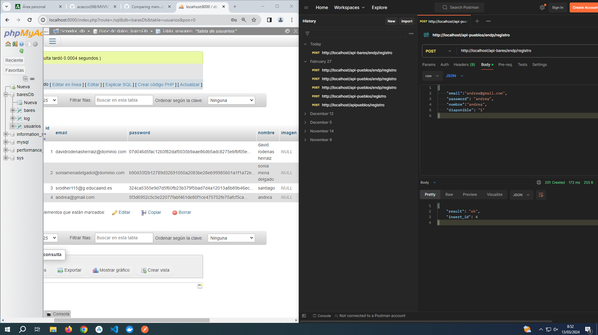
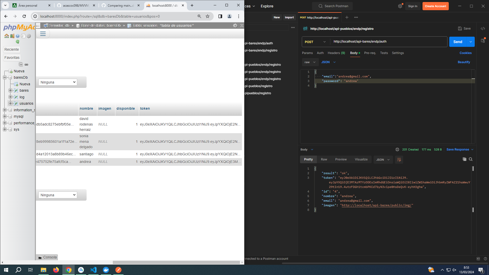
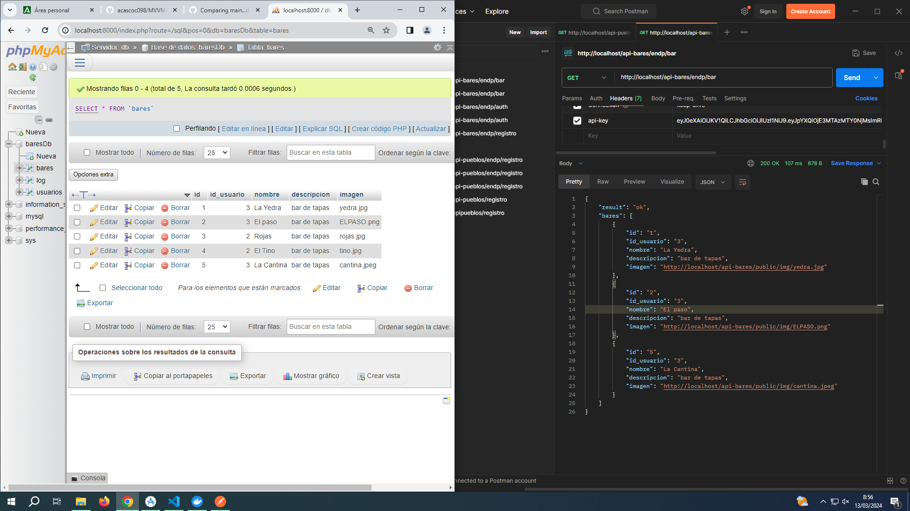

# API-BARES

*AUTORA: ANDREA CASTILLA COCERA*

[REPOSITORIO](https://github.com/acascoc098/docker-lamp-bares.git)  `dev`

[PROYECTO](https://github.com/acascoc098/MVVM_PP.git) `retrofit`

### Cambios primarios

Los primeros cambios que hice fue a la hora de crear el contenedor:
```yml
db:
        image: mysql
        ports: 
            - "3306:3306"
        command: --default-authentication-plugin=mysql_native_password
        environment:
            MYSQL_DATABASE: baresDb <-
            MYSQL_PASSWORD: andrea <-
            MYSQL_ROOT_PASSWORD: andrea <-
....
```
Y por otro lado:
```yml
phpmyadmin:
        image: phpmyadmin/phpmyadmin
        links: 
            - db:db
        ports:
            - 8000:80
        environment:
            MYSQL_USER: root
            MYSQL_PASSWORD: andrea <-
            MYSQL_ROOT_PASSWORD: andrea <-
```

Y en el documento sql, donde cambio la tabla de pueblos por la de bares:
```sql
CREATE TABLE `bares` (
  `id` int(11) NOT NULL,
  `id_usuario` int(11) NOT NULL,
  `nombre` varchar(100) NOT NULL,
  `descripcion` varchar(250) NOT NULL,
  `imagen` varchar(100) DEFAULT NULL
) ENGINE=InnoDB DEFAULT CHARSET=utf8mb4;

INSERT INTO `bares` (`id`, `id_usuario`, `nombre`, `descripcion`, `imagen`) VALUES
(1, 3, 'La Yedra', 'bar de tapas', 'yedra.jpg'),
(2, 3, 'El paso', 'bar de tapas', 'ELPASO.png'),
(3, 2, 'Rojas', 'bar de tapas', 'rojas.jpg'),
(4, 2, 'El Tino', 'bar de tapas', 'tino.jpg'),
(5, 3, 'La Cantina', 'bar de tapas', 'cantina.jpeg');
```

### Cambios en api-bares

###### ENDP
El cambio más repetido que he hecho ha sido el de cambiar en los endpoints api-pueblos por -> `api-bares`.

También me ha parecido interesante utilizarlos con Postman y jugar con el token para ver x bares según el ususario, 
registrarse y al hacer login ver como se devuelve el token.
A continuación vemos algunos ejemplos:



En esta acaptura vemos como se haría un registro y como saldría en la base de datos, donde no se ve, 
pero hasta que no nos logeamos no obtenemos un token.

Y el login quedaría así:



Por último, vemos lo que devuelve el endpoint bar, con el usuario de email `srodher115@g.educaand.es` (ya que con el nuevo 
usuario no devuelve ningún bar todavía):



###### MODELOS

En eset apartado el principal cambio es el del modelo de la lista, en mi caso bares, donde los parámetros permitidos cambian según la tabla del sql:
```php
private $table = 'bares'; !!!

//parámetros permitidos para hacer consultas selección.
	private $allowedConditions_get = array(
		'id',
		'id_usuario',
		'nombre',
		'descripcion',
		'imagen',
	);


	//parámetros permitidos para la inserción.
	private $allowedConditions_insert = array(
		'id_usuario',
		'nombre',
		'descripcion',
		'imagen',
	);

	//parámetros permitidos para la actualización.
	private $allowedConditions_update = array(
		'nombre',
		'descripcion',
		'imagen',
		
	);
```

###### MODELOS-DATOS

Por último, el cambio que debemos hacer tanto en `authModel` como en `database` es la conexión a la base de datos:
```php
...{
    $this->connection = new mysqli('db', 'root', 'andrea', 'baresDb', '3306');

    ...
}...
```

### *PLUS*
He añadido en la carpeta '.../public/img/' imágenes de los bares para insertarlos en la base de datos.